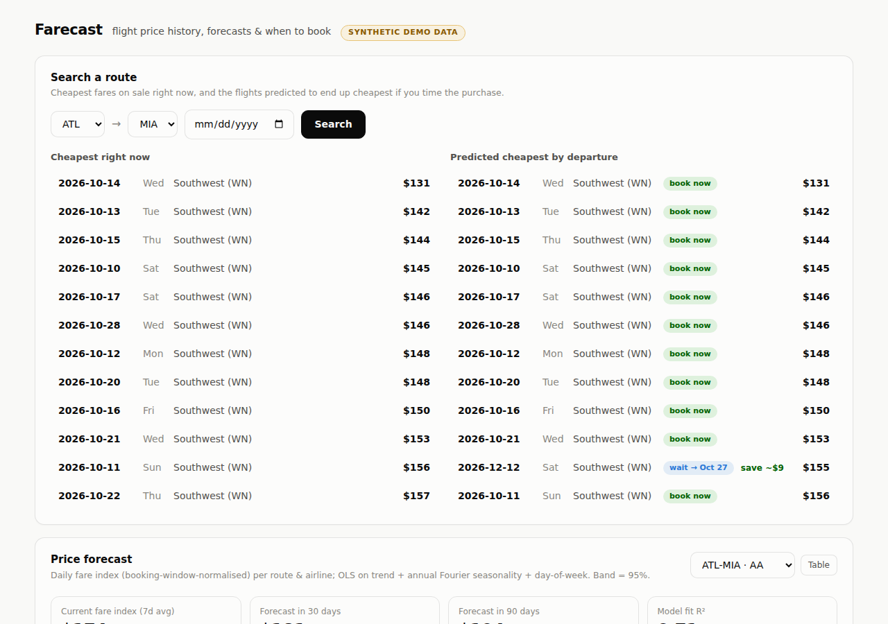

# Farecast — flight cost tracker & price predictor

A dashboard that models flight prices per route × airline and answers two
questions: **what's cheapest right now**, and **which flights will end up
cheapest if you time the purchase** (and when to buy them).



## Coverage

158 directional routes across 46 airports and 47 airlines (496 route×airline
series): intra-Europe, intra-Asia, intra-Australia/NZ, and the long-haul
markets between them (Europe↔Asia, Europe↔Australia, Asia↔Australia), plus a
US domestic set. Routes are declared by region and haul length in
`app/synthetic.py`; the economics — seasonal amplitude and peak hemisphere,
oil sensitivity, and where the booking curve bottoms out — are derived from
those tags, so adding a route is one line.

## Run it

```bash
pip install -r requirements.txt
uvicorn app.main:app --port 8000
# open http://localhost:8000
```

Tests: `python -m pytest tests/`

## Models

All models run on a daily observation table
`(search_date, flight_date, origin, dest, airline, fare)`:

1. **Daily fare index + linear regression** (`app/models.py`).
   Fares are normalised by the booking curve to a per-day price index for each
   route × airline (1-day granularity, 7-day rolling average). A regression on
   log fare — annual Fourier seasonality (2 harmonics) + day-of-week + a
   lagged-oil term whose coefficient is fixed to the elasticity from the lag
   model (free-fitting it is collinear with seasonality on short windows) —
   produces the forecast with a 95 % band. Observations are recency-weighted
   (2-year half-life). This configuration was chosen by
   `scripts/sweep.py` on a validation year and confirmed once on a held-out
   test year (`data/sweep_results.json`); notably the linear trend term was
   *dropped* — it extrapolates noise and cost ~3pp MAPE out of sample.

2. **Booking curve ("when to book")**. Log-fare regressed on
   days-to-departure buckets with flight fixed effects (within-flight
   demeaning), so the curve isn't confounded by *which* flights get observed
   at which horizon. Used to predict each flight's remaining price path,
   anchored to its currently observed fare → best buy date, expected saving,
   and a book-now / wait verdict.

3. **Correlation matrix** between every route × airline pair, computed on
   weekly log fare *changes* (levels would correlate trivially through shared
   seasonality). The dashboard summarises same-route pairs (airlines matching
   each other on a path), same-airline pairs (network-wide pricing) and
   unrelated pairs.

4. **Oil → fares lag model**. Cross-correlation of 4-week Brent changes
   (30-day smoothed) against 4-week fare-index changes at lags 0–90 days.
   The pooled argmax and the mean of per-series argmaxes give the average
   pass-through delay; a lagged OLS gives the elasticity
   (Δlog fare / Δlog Brent) and R² at the best lag.

## Methodology write-up

`docs/regression-methodology.pdf` documents every step — booking curve,
index construction, oil lag and elasticity, the forecast design matrix,
buy-timing, correlations and the validation protocol — with the estimators
written out. Regenerate it with `python scripts/build_methodology_pdf.py`
(it reads measured numbers out of `site/core.js`, so it cannot drift from
the model).

## Deploying

`python scripts/build_static.py` writes `site/`: a fully static snapshot
with `core.js` loaded up front and one lazily-loaded chunk per route, so the
first paint stays ~280 KB regardless of network size. `vercel.json` serves
it with no build step.

## Data — read this

**There is no free, ongoing source of daily route × airline fares.**
That was checked before building this (see the table in the project history):
BTS DB1B/OD40 is quarterly/monthly averages, Amadeus's self-service API only
returns historical quartiles, OAG/scraper feeds are paid. The app therefore
runs on three sources, in priority order:

| Priority | Source | Status |
|---|---|---|
| 1 | `data/fares.parquet` — **real data** | plug in via one of the two paths below |
| 2 | Synthetic generator (`app/synthetic.py`) | used automatically otherwise; the dashboard shows a **SYNTHETIC DEMO DATA** badge |

**Crude oil is real data**: daily EIA Brent/WTI spot prices
(`data/brent-daily.csv`, `data/wti-daily.csv`, public domain), refresh with
`python scripts/fetch_oil.py`.

### Plugging in real fare data

* **Kaggle backfill** — the only free dataset matching this app's schema is
  [dilwong/flightprices](https://www.kaggle.com/datasets/dilwong/flightprices)
  (~31 GB of Expedia quotes, 16 US airports, Apr–Oct 2022). Download it where
  you have Kaggle access, then `python scripts/compact_kaggle.py itineraries.csv`
  writes `data/fares.parquet`.
* **Forward collection** — append rows to `data/fares.parquet` daily from any
  quote source you have (an API key, a scraper). Schema:
  `search_date, flight_date, origin, dest, airline, fare, source`.

The synthetic data is generated with a *known* booking curve, seasonality,
route-level shocks shared across airlines, and a 45-day lagged Brent
pass-through — so the test suite (`tests/test_models.py`) verifies the models
recover the planted structure (lag found: ~51 days; same-route correlation
0.82 vs 0.03 for unrelated pairs).

### Honest caveats

* With only ~6 months of real Kaggle history, the oil-lag model cannot be
  identified reliably — it needs multi-year fare history. On synthetic data it
  demonstrably works; treat real-data lag estimates as indicative only.
* Fare forecasting on seasonality + lagged oil gives calibrated *typical*
  prices; it will not predict fare sales or capacity shocks, and an oil shock
  after the forecast date is unknowable (oil is frozen at "today" — no
  lookahead), which shows up as bias in the backtest's second split.
* Search supports one-way and return trips with optional depart/return dates
  (±3-day window); return combos pair any two carriers and the best-buy date
  is chosen jointly for both legs.
